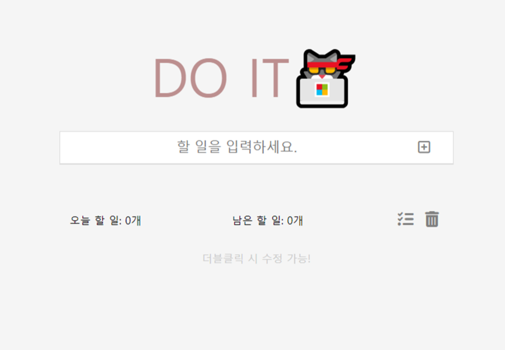
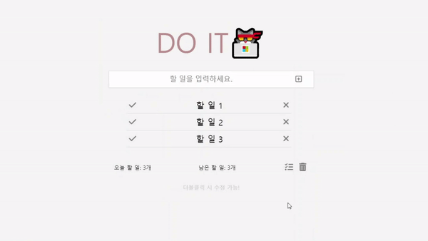
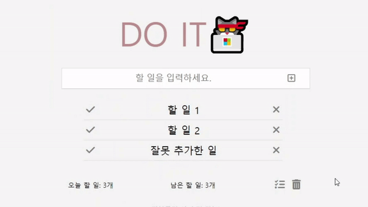
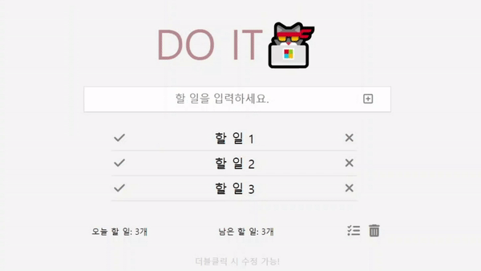

# DO IT🐱‍💻



## 🧾 간단한 투두리스트

> 개발 기간 : 2023.08.24 ~ 2023.08.26 (14시간)

> 10.23 - 더블클릭 시 수정 기능 추가

## 🥞 Stack

 
 


## 🎮 DO IT이 가진 기능

### 1. 할 일 저장

- 해야할 일을 적고 추가할 수 있어요.  
  

### 2. 완료 상태로 변경

- 내가 끝마친 일은 클릭하면 완료 상태로 바꿔줘요.
- 완료 상태에서 다시 한 번 누르면 원래 상태로 돌아와요.  
  

### 3. 할 일의 개수 표시

- 전체 할 일의 개수와 남은 할 일의 개수를 구분하여 표시해준답니다.  
  

### 4. 할 일 삭제

- 잘못 추가했거나 오늘 일정을 바꿨을 때 추가했던 할 일을 삭제할 수 있어요.  
  

### 5. 전체 완료 / 전체 삭제

- 리스트에 추가된 모든 할 일을 한 번에 완료할 수 있고, 원상태로 복구도 가능해요.
- 모든 일을 완료했다면 리스트에서 지우기 편하게 한 방에 삭제도 가능해요.  
  

### 6. 아이템 영역 더블클릭하면 해당 아이템의 내용 수정

- 추가했던 아이템의 내용을 수정하고 싶을 때 원하는 대로 바꿀 수 있어요.
<!-- gif 삽입하기 -->

## ❓ 프로젝트를 만들면서 만났던 벽과 솔루션

### 1. 리스트에 할 일이 많아 스크롤이 생겼을 때 (솔루션: 챗GPT)

할 일이 적힌 아이템이 ul 리스트에 많이 추가되어 스크롤이 만들어진다.  
새로운 아이템이 추가될 때 이미 스크롤이 만들어진 상태에서 추가가 되면  
뷰가 새로운 아이템으로 따라가지 않고 화면 상단에 머물러 있는다.

```js
item.scrollIntoView({ block: 'center', behavior: 'smooth' });
```

그래서 위 코드를 이용하여 아이템이 추가되면 스크롤이 아이템을 따라가도록 했다.  
scrollIntoView 메소드는 scrollIntoView가 호출된 요소가 사용자에게 표시되도록  
요소의 상위요소를 스크롤한다.

block은 수직정렬을 결정하고 behavior는 애니메이션을 결정한다.  
나는 각각 'center', 'smooth'로 뷰포트 가운데로 부드럽게 스크롤하도록 만들었다. 하지만 해당 코드를 글로벌 스코프에서 선언했더니 작동하지 않았다.  
그래서 챗GPT에게 리팩토링을 부탁했고 솔루션을 얻었다.

알고 보니, scrollIntoView()가 실행되는 타이밍과 item이 실제로 DOM에 추가되는 타이밍이 일치해야 했다.  
즉, createItem() 함수 내에서 ul.appendChild(item)이 실행된 후에 scrollIntoView()가 호출되어야 했던 것이다.

그래서 위의 코드를

```js
ul.appendChild(item);
```

이 코드 다음 줄로 옮겼더니 원하는 대로 동작했다!

### 2. 전체 완료 기능을 만들 때 (솔루션: 구글링)

```js
doneAll.addEventListener('click', () => {
  const allText = document.querySelectorAll('.todo__item-text');
  allText.classList.toggle('done');
  leftCount();
});
```

처음에 그냥 querySelectorAll을 이용해서 'todo\_\_item-text'라는 클래스를 가진 모든 item에 toggle을 해주면 전체 완료가 될 거라 생각해서 위의 코드로 실행했더니,  
아무런 작동을 하지 않았다. 그래서 뭐가 문제인지 몰라 구글링으로 블로그를 뒤져보다가 querySelectorAll로 선택한 요소들은 리스트 형태로 가져오기 때문에  
forEach문을 사용해서 클래스를 바꿔야한다는 것을 알게 됐다.

그래서

```js
doneAll.addEventListener('click', () => {
  const allText = document.querySelectorAll('.todo__item-text');
  allText.forEach((text) => {
    text.classList.toggle('done');
  });
  leftCount();
});
```

해당 코드로 이벤트리스너 안의 코드를 수정했고, 원하는 대로 동작하는 것을 볼 수 있었다.

### 3. 더블클릭 시 아이템 내용 수정 기능 만들기 (솔루션: 챗GPT)

정말 진땀을 뺀... 구글링을 수도 없이 하고 결국엔 챗GPT와의 몇 번의 티키타카 끝에 만들 수 있었던 기능!

처음에는 item을 querySelector로 지정하여 텍스트를 수정하는 이벤트리스너를 createItem 함수 내부에 등록했다.

▼ 1번째 삽질

```js
item.addEventListener('dblclick', () => {
  const itemText = item.querySelector('.todo__item-text');
  const editInput = document.createElement('input');
  editInput.setAttribute('type', 'text');
  editInput.setAttribute('class', 'todo__edit-input');
  editInput.value = itemText.innerText;

  item.replaceChild(editInput, itemText);
  editInput.focus();

  editInput.addEventListener('blur', () => {
    itemText.innerText = editInput.value;
    item.replaceChild(itemText, editInput);
  });

  editInput.addEventListener('keydown', (event) => {
    if (event.key === 'Enter') {
      editInput.blur();
    }
  });
});
```

근데 아이템을 더블클릭을 해도 이벤트리스너가 작동하지 않았다.  
이 문제를 해결하기 위해 구글링을 하며 블로그 게시물들을 뒤져봤지만, 나와 같은 문제를 겪었던 사람은 없어 솔루션을 얻지 못했다.  
그래서 챗GPT에게 소스코드를 입력해가며 어떤 점이 문제인지 찾은 결과 리스트에 추가된 아이템은 querySeletorAll을 이용해서 아이템들을 지정하고  
forEach문을 통해서 아이템에 이벤트리스너를 등록해야 한다는 사실을 알게 됐다.

▼ 2번째 삽질

```js
const items = document.querySelectorAll('.todo__item');

items.forEach((item) => {
  item.addEventListener('dblclick', () => {
    const itemText = item.querySelector('.todo__item-text');
    const editInput = document.createElement('input');
    editInput.setAttribute('type', 'text');
    editInput.setAttribute('class', 'todo__edit-input');
    editInput.value = itemText.innerText;

    item.replaceChild(editInput, itemText);
    editInput.focus();

    editInput.addEventListener('blur', () => {
      itemText.innerText = editInput.value;
      item.replaceChild(itemText, editInput);
    });

    editInput.addEventListener('keydown', (event) => {
      if (event.key === 'Enter') {
        editInput.blur();
      }
    });
  });
});
```

하지만 이번에는 여러개의 아이템이 있을 때 첫 번째 아이템만 수정이 가능한 문제가 발생했다.  
문제 해결을 위해서 다시 GPT의 힘을 빌렸다.

▼ 3번째 삽질

```js
const items = document.querySelectorAll('.todo__item');

items.forEach((item) => {
  item.addEventListener('dblclick', () => {
    const itemText = item.querySelector('.todo__item-text');

    const editInput = document.createElement('input');
    editInput.setAttribute('type', 'text');
    editInput.setAttribute('class', 'todo__edit-input');
    editInput.value = itemText.innerText;

    itemText.style.display = 'none';
    item.appendChild(editInput);

    editInput.focus();

    editInput.addEventListener('blur', () => {
      itemText.innerText = editInput.value;
      itemText.style.display = 'inline-block';
      item.removeChild(editInput);
    });

    editInput.addEventListener('keydown', (event) => {
      if (event.key === 'Enter') {
        editInput.blur();
      }
    });
  });
});
```

그렇게 또 새로운 문제를 해결했지만... editInput이 생기고 itemText의 display는 'none'이 적용되지 않는 문제가 생기는 등,  
그 후에도 두 번 정도의 새로운 문제 상황이 생겨났었는데 결국은 완성된 코드에서 보듯 원하는 동작을 문제없이 할 수 있도록 구현했다.

## 🛒 향후 업데이트로 추가될 기능

### 1. 오늘 날짜를 표시해주는 indicator 기능
