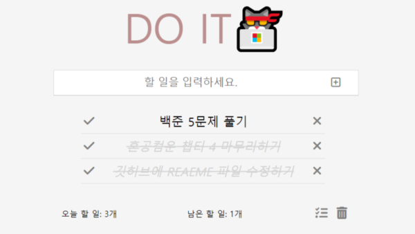

# DO IT🐱‍💻


## 🧾 간단한 투두리스트

> 개발 기간 : 2023.08.24 ~ 2023.08.26 (14시간)

## 🥞 스택

 
 


## 🎮 투두리스트가 가진 기능

### 1. 할 일 저장

- 해야할 일을 적고 추가할 수 있음
  

### 2. 완료 상태로 변경

- 내가 끝마친 일은 클릭하면 완료 상태로 바꿔줌
- 완료 상태에서 다시 한 번 누르면 원래 상태로 돌아옴
  

### 3. 할 일의 개수 표시

- 전체 할 일의 개수와 남은 할 일의 개수를 구분하여 표시
  

### 4. 할 일 삭제

- 잘못 추가했거나 오늘 일정을 바꿨을 때 추가했던 할 일을 삭제할 수 있음
  

### 5. 전체 완료 / 전체 삭제

- 리스트에 추가된 모든 할 일을 한 번에 완료할 수 있고, 원상태로 복구도 가능
- 모든 일을 완료했다면 리스트에서 지우기 편하게 한 방에 삭제도 가능
  

## ❓ 프로젝트를 만들면서 만났던 벽과 솔루션

### 1. 리스트에 추가된 아이템을 정렬하는 과정

```js
item.scrollIntoView({ block: 'center', behavior: 'smooth' });
```

해당 코드는 'todo\_\_list'라는 클래스명을 가진 ul 리스트에 아이템이 추가될 때,
리스트의 중앙에 정렬되어 추가될 수 있도록 만들어 주는 코드.

<!-- 처음에 어디에 추가했었고 어떤 오류가 있었는지 -->

## 향후 업데이트로 추가될 기능

### 1. 리스트에서 수정하고 싶은 할 일을 더블클릭하면 수정 가능

### 2. 오늘 날짜를 표시해주는 indicator 기능
